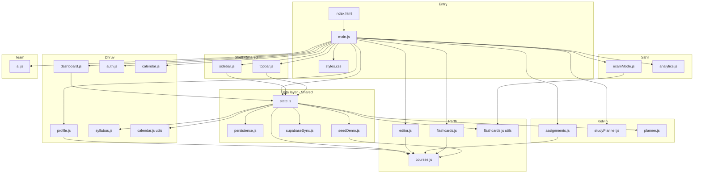

# File ownership & dependencies

**Student Workspace** · `parth` branch (simplified MVP)  
Who works on which file, and what each file needs from other files.

---

## Team at a glance

| Person | Student ID | Epics | Primary files |
|--------|------------|-------|----------------|
| **Dhruv Patel** | N10015893 | 1, 2 | `dashboard.js`, `profile.js`, `auth.js` |
| **Parth Patel** | N01779255 | 3, 7 | `editor.js`, `courses.js`, `flashcards.js` |
| **Kelvin Idoko** | N01777723 | 5, 6 | `assignments.js`, `studyPlanner.js`, `planner.js` |
| **Sahil Maniya** | N01769967 | 8, 9 | `examMode.js`, `analytics.js` |
| **Whole team** | — | 4 | `ai.js` (placeholder) |
| **Shared** | — | — | `main.js`, `state.js`, `sidebar.js`, `topbar.js`, `styles.css` |

Personal demo guides: [README-DHRUV](./README-DHRUV.md) · [README-PARTH](./README-PARTH.md) · [README-KELVIN](./README-KELVIN.md) · [README-SAHIL](./README-SAHIL.md)

---

## Ownership by file

### Entry & shell (shared)

| File | Owner | Role | Status |
|------|-------|------|--------|
| `main.js` | **Shared** (all) | Imports every screen, wires sidebar/topbar, calls `state.js` | Active |
| `index.html` | **Shared** | App mount point, loads `main.js` | Active |
| `styles/styles.css` | **Shared** | All UI styles (Humber orange theme on `parth`) | Active |
| `vite.config.js` | **Shared** | Dev server / build | Active |
| `package.json` | **Shared** | npm scripts, Vite + Tailwind + Supabase deps | Active |

### Components — by person

| File | Owner | Epic | Depends on |
|------|-------|------|------------|
| `components/dashboard.js` | **Dhruv** | 2 | `utils/shared.js`, `state.js` (assignments, pages, calendar, flashcards, studyLog) |
| `components/profile.js` | **Dhruv** | 1 | `utils/courses.js`, `utils/shared.js`, `state.js` (profile, syllabus) |
| `components/auth.js` | **Dhruv** | 1 | `state.js`, `utils/supabase.js` |
| `components/dbSetup.js` | **Dhruv** | 1 | Supabase connection helpers |
| `components/calendar.js` | **Dhruv** (lead) | 2 / calendar | `utils/calendar.js`, `state.js` |
| `components/editor.js` | **Parth** | 3 | `utils/courses.js`, `utils/shared.js`, `state.js` (pages) |
| `components/flashcards.js` | **Parth** | 7 | `utils/courses.js`, `state.js`, `utils/flashcards.js` |
| `components/assignments.js` | **Kelvin** | 5 | `utils/courses.js`, `utils/shared.js`, `state.js` (assignments) |
| `components/studyPlanner.js` | **Kelvin** | 6 | `utils/shared.js`, `state.js` (studyPlan) |
| `components/examMode.js` | **Sahil** | 8 | `utils/shared.js`, `utils/flashcards.js`, `state.js` (active page) |
| `components/analytics.js` | **Sahil** | 9 | `utils/shared.js`, `state.js` (studyLog, assignments, pages) |
| `components/ai.js` | **Team** | 4 | `state.js` only (UI shell, not connected) |
| `components/sidebar.js` | **Shared** | — | `state.js` (nav, pages, search) |
| `components/topbar.js` | **Shared** | — | `utils/shared.js`, `state.js` (active page) |
| `components/modal.js` | **Shared** | — | Trash + event modals used from `main.js` |

### Utils — by person / shared

| File | Owner | Used by | Role |
|------|-------|---------|------|
| `utils/state.js` | **Shared** (touch carefully) | Almost everything | Single source of truth: pages, assignments, sync, navigation |
| `utils/persistence.js` | **Shared** | `state.js` | localStorage read/write |
| `utils/seedDemo.js` | **Shared** | `state.js` | Demo assignments/calendar on first open (no default notes on `parth`) |
| `utils/shared.js` | **Shared** | Most components | `escapeHtml`, dates, small helpers |
| `utils/courses.js` | **Parth** | `editor.js`, `profile.js`, `assignments.js`, `flashcards.js`, `state.js` | Semester course list |
| `utils/flashcards.js` | **Parth** | `state.js`, `flashcards.js`, `examMode.js` | Generate cards from note text, spaced repetition |
| `utils/planner.js` | **Kelvin** | `state.js` | Weekly study plan generator |
| `utils/syllabus.js` | **Dhruv** | `state.js` | Parse syllabus text → calendar dates |
| `utils/calendar.js` | **Dhruv** | `state.js`, `calendar.js` | Month grid + events |
| `utils/supabase.js` | **Shared** | `supabaseSync.js`, `auth.js` | Supabase client config |
| `utils/supabaseSync.js` | **Shared** | `state.js` | Cloud save/load one JSON workspace |

### Docs (planning — not runtime)

| File | Owner |
|------|-------|
| `documents/user_stories.md` | Whole team |
| `documents/project_progress_tracker.md` | Whole team |
| `documents/mosco_timeline.md` | Whole team |
| `documents/FOR_PROFESSOR.md` | Whole team |
| `documents/FILES.md` | Whole team (this file) |

### Not used on `parth` branch (old experiments — safe to ignore)

| File | Note |
|------|------|
| `components/codefusion.js` | Removed — old AI panel |
| `components/home.js` | Removed — replaced by `dashboard.js` |
| `utils/blockEditor.js` | Not imported — old Notion-style editor |
| `utils/slashMenu.js` | Not imported |
| `utils/covers.js` | Not imported |
| `utils/dropdown.js` | Not imported on simplified topbar |

---

## Dependency map (how files connect)



---

## Import chains (simple)

### Parth — notes path (Epic 3)

```
main.js
  → components/editor.js
      → utils/courses.js          (course dropdown)
      → utils/shared.js           (escape HTML)
  → utils/state.js
      → updateActivePage()        (saves page.course, page.lecture, page.content)
      → utils/persistence.js      (localStorage)
```

### Parth — flashcards path (Epic 7)

```
main.js
  → components/flashcards.js
  → utils/state.js
      → generateFlashcardsFromPage()
          → utils/flashcards.js   (reads ## and • from note text)
```

### Kelvin — assignments (Epic 5)

```
main.js
  → components/assignments.js
      → utils/courses.js
  → utils/state.js
      → addAssignment() / moveAssignment() / deleteAssignment()
```

### Sahil — exam prep (Epic 8)

```
main.js
  → components/examMode.js
      → utils/flashcards.js       (same parser as Epic 7)
  → utils/state.js
      → getActivePage()           (needs a note open with ## headings)
```

### Dhruv — dashboard (Epic 2)

```
main.js
  → components/dashboard.js
  → utils/state.js
      → assignments, calendarEvents, pages, flashcards, studyLog
```

### Dhruv — profile + sync (Epic 1)

```
main.js
  → components/profile.js
  → components/auth.js
  → utils/state.js
      → saveProfile() / parseAndImportSyllabus()
      → utils/syllabus.js
      → utils/supabaseSync.js     (optional cloud)
```

---

## Rules when editing

1. **Own your component first** — change your file before changing `state.js`.
2. **`state.js` is shared** — tell the team in chat before adding new fields or renaming exports.
3. **`courses.js` is Parth’s** — ask before changing course names (whole app uses the list).
4. **`shared.js` is safe** — small helpers only; no business logic.
5. **Do not revive** `blockEditor.js` / `codefusion.js` on `parth` — keep the simple textarea editor.

---

## Quick “who do I ask?”

| If you change… | Ask… |
|----------------|------|
| Note editor, page types (+ Todo / + Note / + Journal) | **Parth** |
| Course list | **Parth** |
| Flashcards / exam card generation | **Parth** + **Sahil** |
| Kanban / study planner | **Kelvin** |
| Today dashboard / profile / sign-in | **Dhruv** |
| Analytics charts | **Sahil** |
| AI screen (Epic 4) | **Whole team** |
| Sidebar, main wiring, CSS theme | **Whoever is online** — avoid silent big changes |

---

[← Main README](../README.md) · [For professor](./FOR_PROFESSOR.md) · [Progress tracker](./project_progress_tracker.md)
